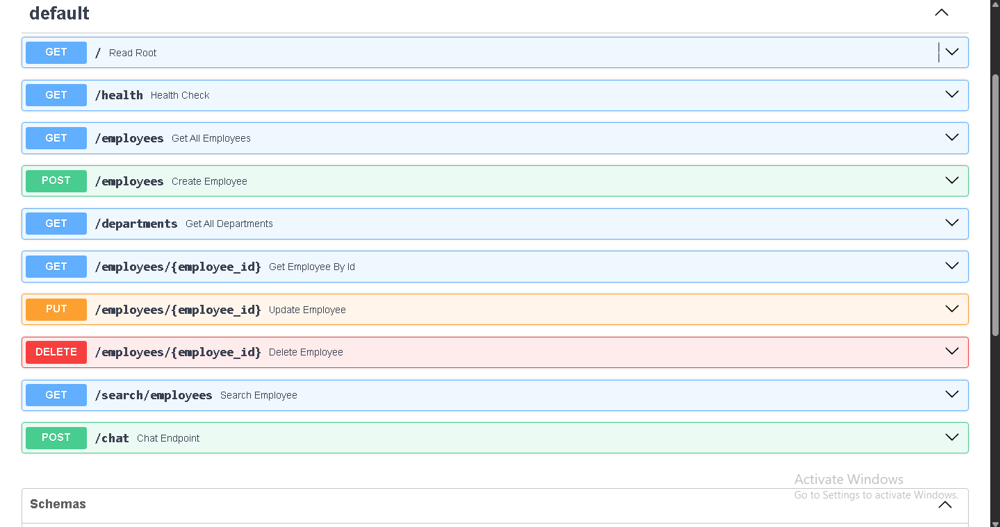

# RAG-Powered Corporate API

    

This repository contains the source code for a high-performance REST API with two primary functions: a robust CRUD interface for corporate data and an intelligent, AI-powered Q&A service built on a Retrieval-Augmented Generation (RAG) pipeline.

---

## Live Demonstration

A live version of this API is deployed to the cloud. **Please contact me directly for the URL and a private demonstration.**

### Demo 




---

## Project Overview & Value Proposition

Did you ever run out of tokens asking an LLM questions? Did you submit multiple large documents, only to have the model fail to process them? This project is the solution.

This API implements a RAG pipeline that gives an LLM a virtually infinite, private memory. It can ingest a library of thousands of documents (`.txt`, `.pdf`, etc.), and when a user asks a question:
1.  It performs a high-speed **semantic search** to find the most relevant pieces of information from across the entire knowledge base.
2.  It then provides only this relevant context to a powerful LLM (Google's Gemini) to synthesize a precise, fact-based answer.

This allows the system to answer questions about private data it was never trained on, dramatically reducing hallucinations and overcoming the context-window limitations of modern LLMs. It doesn't matter if you have 5 documents or 5,000.


---

## Local Development Setup

This project is fully containerized with Docker. The recommended way to run it locally is with Docker Compose.

### Prerequisites
*   Docker Desktop installed and running.
*   Git.

### Instructions
1.  **Clone the Repository:**
    ```bash
    git clone https://github.com/SyedWaleed-X/ai-keystone-project.git
    cd ai-keystone-project
    ```
2.  **Create Environment File:**
    *   Copy the example environment file: `cp .env.example .env` (or copy manually on Windows).
    *   Edit the `.env` file and add your `DB_PASSWORD` and `GEMINI_API_KEY`.

3.  **Run the Indexing Script:**
    *   This script processes the documents in your `/data` folder and builds the local vector database.
    ```bash
    # You will need a local Python environment for this one-time step
    python -m venv .venv
    .\.venv\Scripts\activate
    pip install -r requirements.txt
    python vector_store.py
    ```

4.  **Launch the Application:**
    ```bash
    docker compose up --build
    ```

5.  **Access the API:**
    *   The API will be available at `http://127.0.0.1:8000`.
    *   Interactive documentation is available at `http://127.0.0.1:8000/docs`.

---

## API Endpoints

### Employees

*   **GET `/employees`**: Fetches a list of all employees.
    *   **Response:** `200 OK`
      ```json
      [
        {
          "id": 1,
          "name": "John Smith",
          "hire_date": "2024-03-15",
          "salary": 65000,
          "department_id": 1
        }
      ]
      ```

*   **GET `/employees/{employee_id}`**: Fetches a single employee by their ID.
    *   **Response:** `200 OK` or `404 Not Found`

*   **GET `/search/employees`**: Searches for employees.
    *   **Query Parameter:** `department` (e.g., `/search/employees?department=Sales`)
    *   **Response:** `200 OK

*   **POST '/chat'**: Gives you answer based on your queries and the specific context provided in your documents.

```bash
curl -X 'POST' \
  'http://127.0.0.1:8000/chat' \
  -H 'accept: application/json' \
  -H 'Content-Type: application/json' \
  -d '{
  "query": "What is the company vacation policy?"
}'
```
{
  "answer": "Based on the context, all employees are entitled to 20 days of paid time off (PTO) per year, which must be approved by their direct manager.",
  "sources": [
    "The official company policy for vacation is that all employees are entitled to 20 days of paid time off (PTO) per year, which must be approved by their direct manager at least two weeks in advance."
  ]
}


